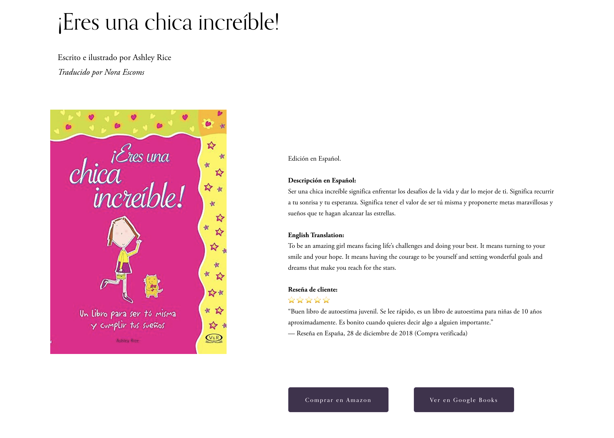
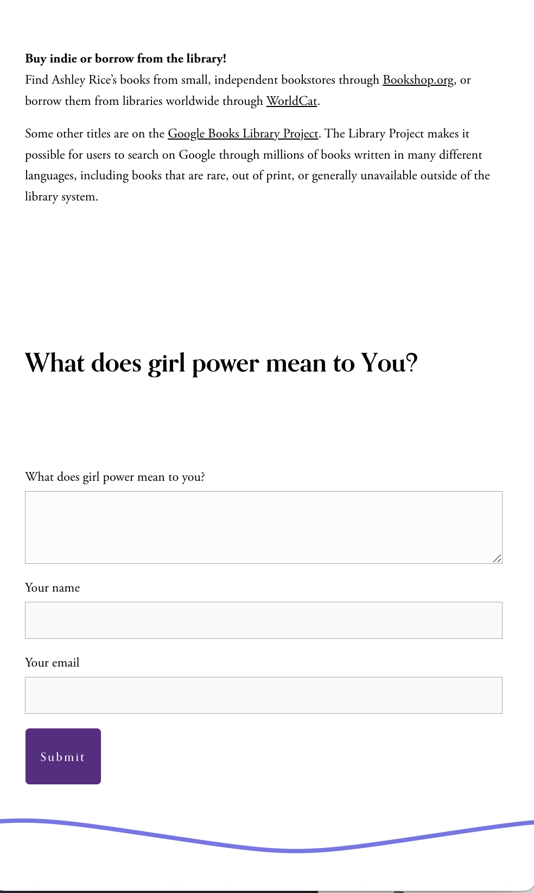
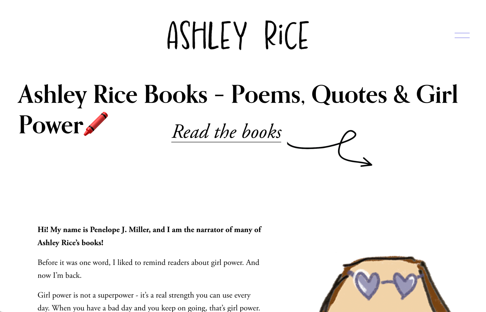
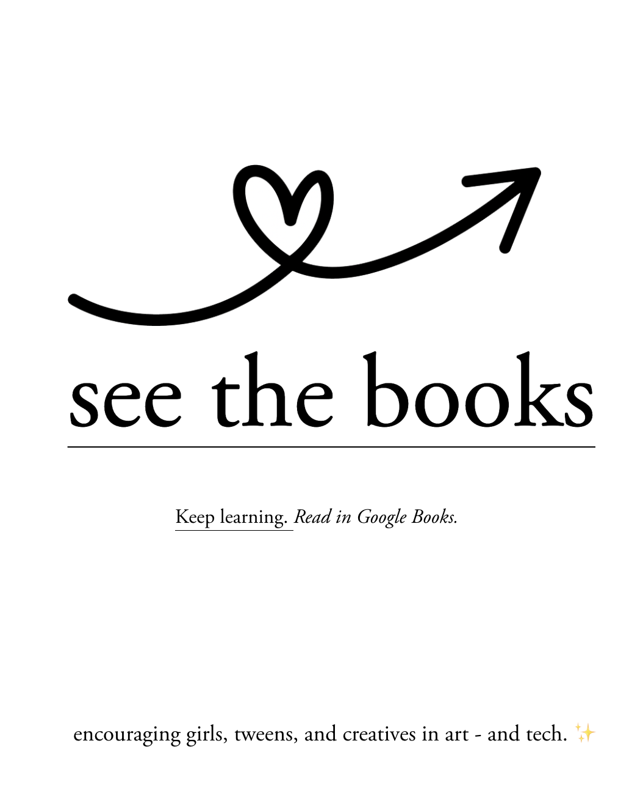
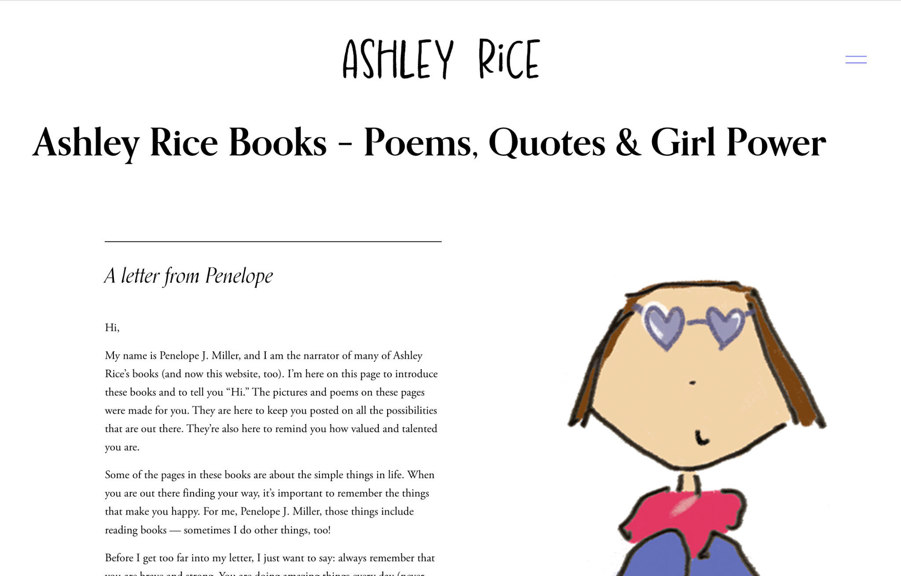

# Books Page Redesign — Structured Captions and Consistent Layout

**Role:** UX Content Designer · Information Architect · Copywriter  
**Platform:** ashleyrice.net (Squarespace 7.1)  
**Project Type:** Live Author Website Optimization  

---

## Objective
Redesign the Books page to align all book covers consistently while preserving accessibility, SEO structure, and a clean visual grid.  
The challenge: Squarespace galleries did not allow uniform caption text or proper heading hierarchy, which hurt both usability and search clarity.

---

## Process and Contributions

**Problem Discovery**  
Identified misaligned book covers, inconsistent padding, and duplicate SEO headings flagged by SEMrush.  
Analyzed Squarespace 7.1 gallery behavior and confirmed that captions collapsed the heading structure (H1–H3), affecting crawlability.

**Information Architecture and Technical Approach**  
- Converted the book list to a gallery with a fixed 2:3 aspect ratio for consistent image sizing

---

#### Visual Examples — UX Writing, Hierarchy & Content Clarity

**1. Spanish Edition — “¡Eres una chica increíble!”**  
Demonstrates multilingual UX writing, balanced layout, and clear button microcopy supporting accessibility and inclusivity.  

**2. Google Books Library & Girl Power Form**  
Shows information hierarchy and plain-language explanation for discoverability, followed by a simple interactive form that invites user participation.  

  

---

**3. Books Page Header — “Ashley Rice Books: Poems, Quotes & Girl Power”**  
Highlights top-of-page hierarchy, tone consistency, and visual engagement cue that aligns brand personality with clarity.  

  

  

---

**4. See the Books — Call to Action Design**  
Example of friendly CTA microcopy and visual direction designed to reduce bounce rate and guide visitors deeper into site content.  

  

 

---

**5. Letter from Penelope — Long-Form Narrative Layout**  
Balances text, illustration, and emotional readability for an inviting, narrative-driven UX.  

