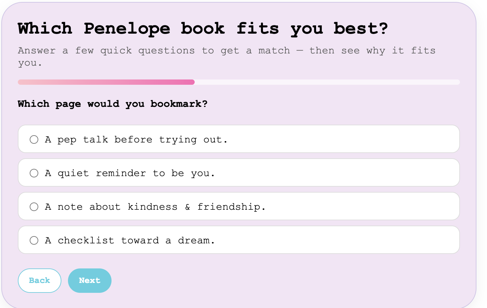
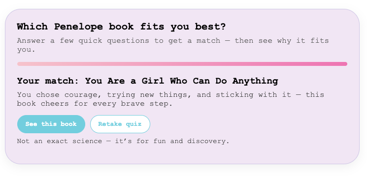

# Interactive Personality Quiz — “Which Penelope Book Fits You Best?”
**Role:** UX Content Designer · Narrative Designer  
**Platform:** ashleyrice.net (JavaScript quiz)  
**Project Type:** Engagement Experience & Content Strategy  

---

## Objective  
Create an interactive, story-based quiz that helps visitors discover which Penelope book best matches their personality — increasing engagement and emotional connection with the brand.  

---

## Process & Contributions  
- Designed the quiz logic and question flow using narrative UX principles.  
- Wrote all question and result copy to reflect the encouraging, empowering voice of the Penelope series.  
- Implemented a progress indicator and microcopy (“No wrong answers,” “Start”) to make the interaction feel low-pressure and inviting.  
- Tested tone and pacing to ensure clarity and completion in under 30 seconds.  

---

## Visual Example  
**Question Screen — “Which page would you bookmark?”**  

  

## Visual Example  
**Result Screen — “Your Penelope book match”**  

  

[Try the quiz live →](https://ashleysally00.github.io/seo-structured-data-fixes/books_quiz.html)
