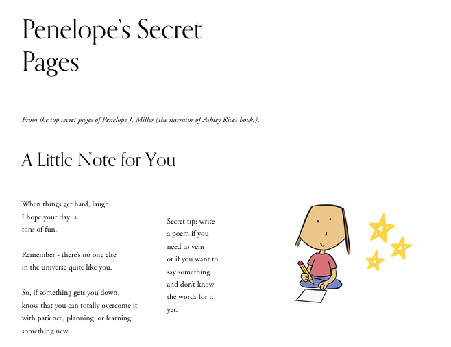

## Penelope’s Secret Pages  
**Interactive UX for Readers and Pinners**

**Role** UX Content Designer · Information Architect · Copywriter  
**Platform** ashleyrice.net (Squarespace 7.1)  
**Duration** 4 weeks  
**Tools** Squarespace · SEO tools · Pinterest  

**The Challenge**  
Tween readers and Pinterest users were landing from pins on generic book pages with no emotional hook and bouncing fast.

**What I Did**  
- Wrote original poems, quotes, birthday messages, and “letters from Penelope”  
- Built a hidden, diary-style hub of discoverable poetry pages  
- Crafted warm microcopy and smart internal navigation to encourage multi-page exploration  
- Optimized page titles, meta descriptions, and rich pins for Pinterest + Google traffic  

**Outcome**  
A living, browsable world that turns Pinterest visitors into delighted readers who explore, pin, and feel personally connected to Penelope before ever seeing a buy button.

**Live experience** → https://ashleyrice.net/penelopes-pages (and sub-pages)

---

### Screenshots  

  

### Individual pages (explore them here)
- [Main hub](https://ashleyrice.net/penelopes-pages)  
- [25 Girl Power Quotes](https://ashleyrice.net/different-quotes)  
- [You’ve Got Guts](https://ashleyrice.net/it-takes-guts)  
- [Wherever You Go…](https://ashleyrice.net/where-you-go-version-2)  
- [A Little Note for You](https://ashleyrice.net/a-little-note-for-you)  
- [Happy Birthday Poems](https://ashleyrice.net/happy-birthday)

---
